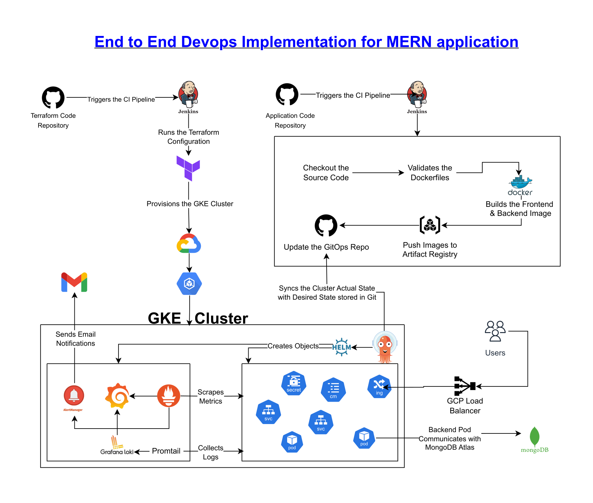

# MERN Application Infrastructure
This repository contains Terraform code to provision and manage the complete cloud infrastructure for deploying a production-ready MERN application on Google Cloud Platform (GCP). The setup includes automated CI/CD, secure networking, Kubernetes (GKE), monitoring, GitOps, and supporting services.

### Checkout the Project Blog [here](https://anjalpoudel.hashnode.dev/mern-on-gke-an-end-to-end-devops-journey-with-terraform-jenkins-gitops-and-prometheus).
---

## Architecture Diagram




---

##  Related Repositories
- [Application Code](https://github.com/greninja517/mernapp-code.git)
- [GitOps Repo](https://github.com/greninja517/mernapp-gitops.git)


## Features
- **Modular Terraform**: Infrastructure is organized into reusable modules (GKE, Bastion Host, Jenkins, etc.).
- **Google Kubernetes Engine (GKE)**: Secure, private cluster with node pools, VPC-native networking, and NAT.
- **Jenkins CI/CD**: Automated pipeline for provisioning, deployment, and lifecycle management.
- **Bastion Host**: Secure jump host for cluster and resource access.
- **GitOps with ArgoCD**: Declarative application delivery and continuous deployment.
- **Monitoring & Logging**: Prometheus, Grafana, Loki, and Promtail for observability.
- **Secrets Management**: KubeSeal for safe secret storage in Git.
- **Firewall & IAM**: Fine-grained access control and network security.
- **Automated Bootstrap Scripts**: For Jenkins and Bastion host provisioning.


## Getting Started

### Prerequisites

- [Terraform](https://www.terraform.io/downloads.html) >= 1.3
- GCP Project with billing enabled
- Service account with necessary permissions
- [gcloud CLI](https://cloud.google.com/sdk/docs/install)
- [kubectl](https://kubernetes.io/docs/tasks/tools/)
- [Helm](https://helm.sh/docs/intro/install/)

### 1. Clone the Repository

```bash
git clone https://github.com/greninja517/mernapp-infra.git
cd mernapp-infra
```

### 2. Configure Environment Variables

Set up your environment-specific variables in `envs/dev/` or `envs/prod/` as needed.

### 3. Initialize and Apply Terraform

```bash
cd envs/dev   # or envs/prod
terraform init
terraform plan
terraform apply
```

### 4. CI/CD Pipeline

The Jenkins pipeline (`Jenkinsfile`) automates provisioning and deployment. Configure Jenkins with your GCP service account credentials and connect it to this repository.


## Post-Provisioning Steps

- **Access Bastion Host**: SSH using the generated public IP and your SSH key.
- **Configure kubectl**: Use the bastion host to interact with GKE.
- **Install ArgoCD, Monitoring, and KubeSeal**: See `cluster-setup.md` for detailed instructions.
- **Manage Secrets**: Use KubeSeal to encrypt and store secrets in Git.


## Documentation

- [`cluster-setup.md`](./cluster-setup.md): Step-by-step guide for cluster access, ArgoCD, monitoring, and secrets management.


